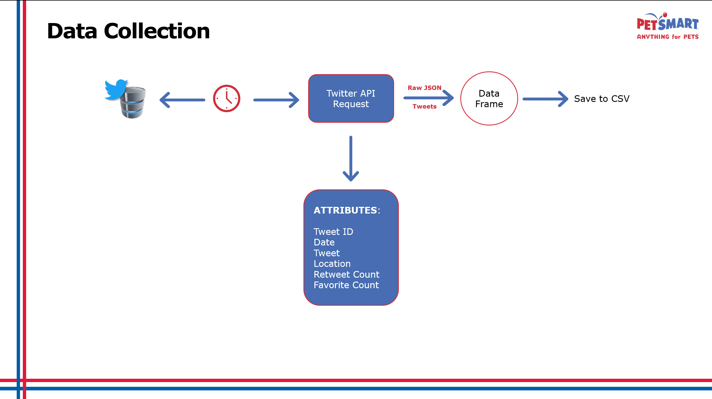
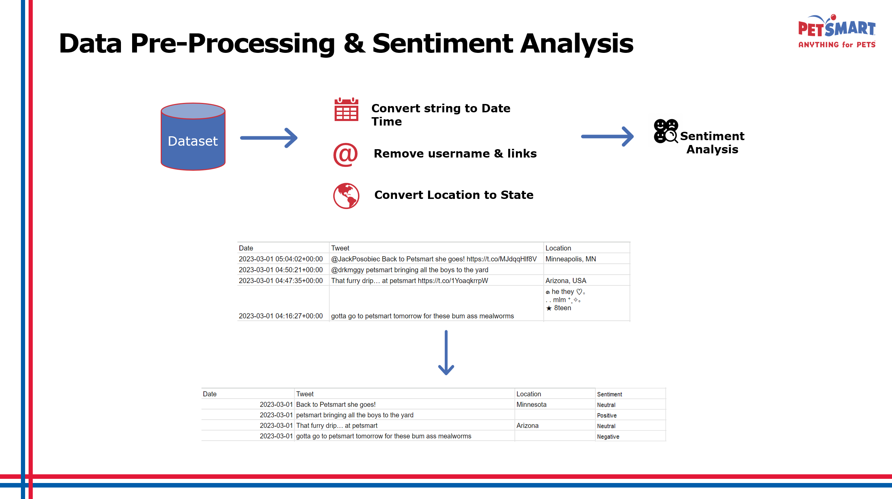

<link rel="stylesheet" href="styles.css" type="text/css">
<link rel="stylesheet" href="site_libs/academicons-1.9.1/css/academicons.min.css"/>

   

## **Sentiment Analysis of Pet retailer**

<!--  -->
<!--  -->

 

🚨**Capstone Project of Master of Science in Business Analytics at Arizona State University.**

 

   

### 1. Executive Summary

+ Goal : To create an End-to-End Data Product that will help one understand the public sentiment of Pet retailer as a brand while understanding what our customers think about other pet retailers. 
+ Objective : To extract people’s opinions from the Tweets collected and classify them into positive, negative, or neutral and identify the trending topics.
+ Data Collection : Scraping using Twitter API and then manually labeled the tweets to evaluate the model performance.

 

<!-- 
 -->
<!--  -->
<!-- 
 -->
<!-- 
 -->
<!-- [Fig. LASSO regression features by importance] -->
<!-- 
 -->

 

### 2. Data Pre-processing

 

 
 

### 3. Sentiment Analysis

+ After analyzing a sample of approximately 6,000 records collected to date, we have observed that the net positive score is 37% and the net negative score is 25%.
+ This is calculated by dividing the total number of positive or negative tweets by the total number of tweets. 
+ We also assessed the model's performance on a sample of 200 records that were labeled manually. Our analysis shows that the model's accuracy is 76%. The precision and recall scores, which are calculated using macro averages, are both around 75% and 78%. 	

 

### 4. Topic Modeling Insights

 

 

+ Topic #3 Adoptable Puppies : Has one of the highest positive sentiment score which explains that the customers really like adoption drives within PetSmart.

+ Topic #5 Aquatic Animals : Has a high negative sentiment score implying a scope for improvement within this segment.

+ Topic #6 Hair & nails : Has one of highest negative sentiment score which explains that the customers are dissatisfied with PetSmart’s grooming services and their experience in store.

### 5. Code

Please click [HERE](https://github.com/Jisoochoi92/Applied_Project) for the analysis report and code.

 

### 6. Dashboard

Please click [HERE](https://app.powerbi.com/groups/me/reports/2592920b-bf33-443e-be6f-84462aa40565/ReportSection) for visualized Power BI dashboard

 

   
