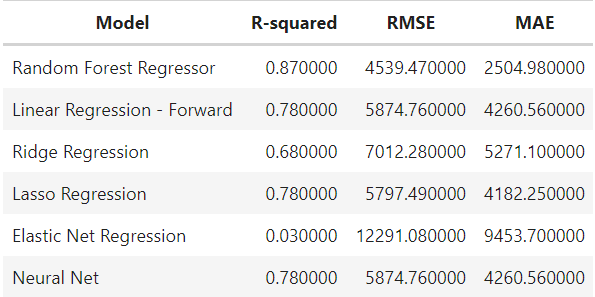

<link rel="stylesheet" href="styles.css" type="text/css">
<link rel="stylesheet" href="site_libs/academicons-1.9.1/css/academicons.min.css"/>

   

## **Medical cost prediction**

<!---->
<!---->

 

<!--🚨**THIS IS A FICTIONAL PROJECT MEANT AS AN EXAMPLE FOR THE STEPBYSTAT COMMUNITY.** -->

   

### 1. Objectives

+ In healthcare industry, it is always challenging to predict insurance cost accurately because of uncertainty and complexity of insurance plans.

+ The objective of this project is to predict the insurance charges based on the given demographic and health information of individuals.

+ This project aims to investigate the relationship between various patient characteristics and medical costs using multiple linear regression with forward/backward feature selection, as well as incorporating regularization methods such as Ridge regression, LASSO regression, and Elastic Net (with a ratio of 0.5). Additionally, a neural network approach was employed to explore the predict the outcome variable. Model performance was evaluated using R-squared, Root-mean-squared error (RMSE), and mean absolute error (MAE).

### 2. Summary

+ Model Performance
 

   

### 3. Jupyter Notebook

For more insights, please click [HERE](https://nbviewer.org/github/Jisoochoi92/medicalcost_prediction/blob/main/Medical_cost_Personal_Data_Jisoo_Choi.ipynb) for python codes. 

