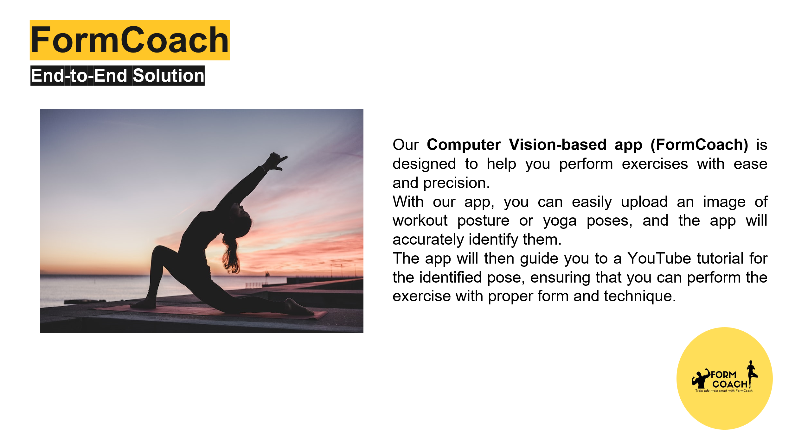

<link rel="stylesheet" href="styles.css" type="text/css">
<link rel="stylesheet" href="site_libs/academicons-1.9.1/css/academicons.min.css"/>

   

## **Deep Learning Project : Form Coach (Computer vision)**

 

🚨**Deep Learning Final Project of Master of Science in Business Analytics at Arizona State University.**

   

### 1. End-to-End Solution

   

### 2. Why Computer Vision?

+ Existing methods (manually recording & reviewing videos) are time-consuming, rely heavily on the expertise of yoga instructor
+ CV enables an automated, real-time analysis
+ CV can detect subtle differences in pose for advanced students

+ Yoga Classification : ResNet50 was used
+ Workout Classification : InceptionV3 was used

   

### 3. Proof-of-concept Demo

For more insights, please check demo website by clicking [HERE](https://public.tableau.com/app/profile/davidhoskins/viz/SquidGameWARNINGMAJORSPOILERS/SquidGame).

